Sample code and my exercise solutions for the book "Introduction to 3D Game Programming with DirectX 12".

Shader Model is updated to 5.1 and some simple exercises may be omitted or merged together.

**A yellow circle** may appear in figures below due to my **mouse click** captured by the screen recording software.

## Samples

* Chapter 01 Vector Algebra
  
  * *XMVECTOR* : Sample usage of DirectX math vector.
  
* Chapter 02 Matrix Algebra
  
  * *XMMATRIX* : Sample usage of DirectX math matrix.
  
* Chapter 04 Direct3D Initialization
  
  * *Init Direct3D* : Sample application framework.
  
* Chapter 06 Drawing in Direct3D 
  
  * *Box* : Render a colored box with a movable camera.
  
    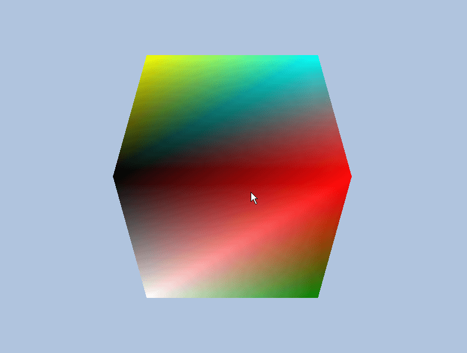
  
* Chapter 07 Drawing in Direct3D Part II
  * *Shapes* ：Render a scene composed of spheres, cylinders, a box and a grid.
  
    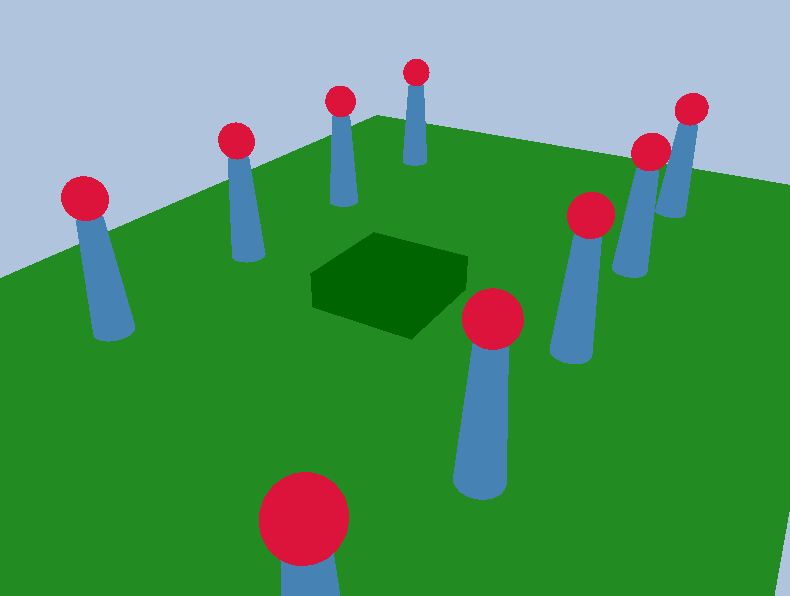
  
  * *Land and Waves* :  Emulate rolling land and waving water by modifying the grid. To draw waves, `Dynamic Vertex Buffer` is used to update vertex positions on CPU side as time passes.
  
    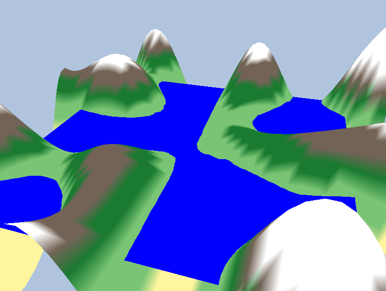
  
* Chapter 08 Lighting
  * *LitColumns* : This demo is based on the *Shapes* demo from the previous chapter, adding materials and a three-point lighting system.
  
    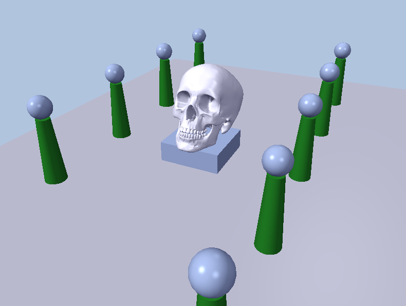
  
  * *LitWaves* : This demo is based on the *Land and Waves* demo from the previous chapter. It uses one directional light to represent the sun. The user can rotate the sun position using the left, right, up, and down arrow keys. 
  
    
  
* Chapter 09 Texturing
  * *Crate* : Render a cube with a crate texture.
  
    
  
  * *TexWaves* : This demo is based on the *LitWaves* demo from the previous chapter, adding textures to the land and water. Also the water texture scrolls over the water geometry as a function of time.
  
    
  
  * *TexColumns* : This demo is based on the *LitColumns* demo from the previous chapter, adding textures to the ground, columns and spheres.
  
    
  
* Chapter 10 Blending
  
  * *BlendDemo* : This demo is based on the *TexWaves* demo from the previous chapter, adding blending effect to the land and water. Also add fog to the scene.
  
    
  
* Chapter 11 Stenciling
  
  * *StencilDemo* : Render a scene with a wall, a floor, a mirror and a skull. The mirror can reflect the skull and the shadow of the skull is on the floor.
  
    
  
* Chapter 12 The Geometry Shader
  
  * *TreeBillboards* : This demo is based on the *Blend* demo from the previous chapter, add tree billboards to the scene. Assuming the y-axis is up and the xz-plane is the ground plane, the tree billboards will generally be aligned with the y-axis and just face the camera in the xz-plane.
  
    
  
* Chapter 13 The Compute Shader
  * *VecAdd* : Use compute shader to add up vectors.
  
  * *Blur* : This demo is based on the *Blend* demo from Chapter 10, adding blur effect to the whole screen with the help of compute shader.
  
    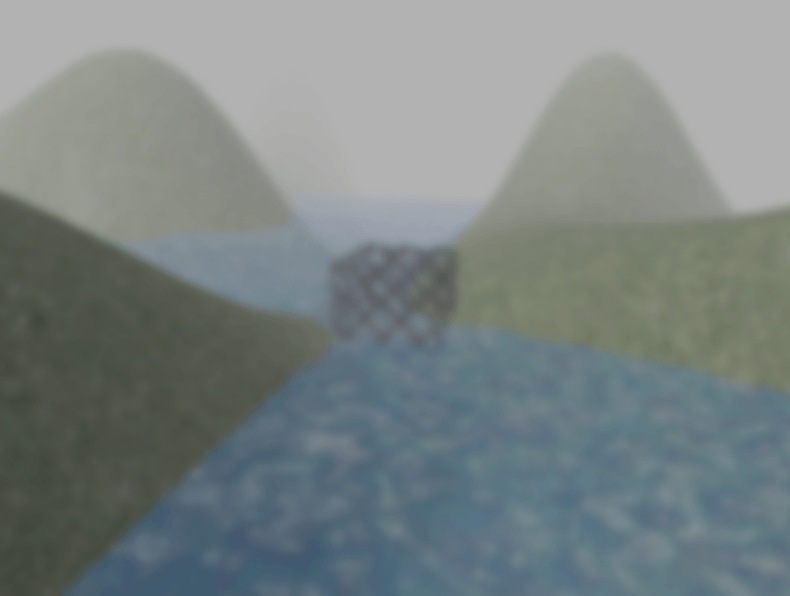
  
  * *WavesCS* : This demo is based on the *Blend* demo from Chapter 10, porting the wave to a GPU implementation. Use textures of floats to store the previous, current, and next height solutions. Because UAVs are read/write, we can just use UAVs throughout and don't bother with SRVs. Use the compute shader to perform the wave update computations. A separate compute shader can be used to disturb the water to generate waves. After you have update the grid heights, you can render a triangle grid with the same vertex resolution as the wave textures (so there is a texel corresponding to each grid vertex), and bind the current wave solution texture to a new “waves” vertex shader. Then in the vertex shader, you can sample the solution texture to offset the heights (this is called displacement mapping) and estimate the normal.
  
  * *SobelFilter* : This demo is based on the *Blend* demo from Chapter 10. Use render-to-texture and a compute shader to implement the Sobel Operator. After you have generated the edge detection image, multiply the original image with the inverse of the image generated by the Sobel Operator to get the results.
  
    
  
* Chapter 14 The Tessellation Stages
  * *BasicTessellation* : Submit a quad patch to the rendering pipeline, tessellate it based on the distance from the camera, and displace the generated vertices by a mathematic function that is similar to the one we have been using for “hills”.
  
    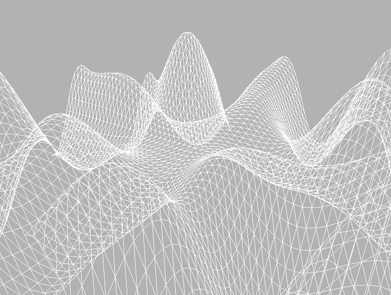
  
  * *BezierPatch* : Submit a quad patch to the rendering pipeline, tessellate it and displace the generated vertices using cubic Bézier function.
  
    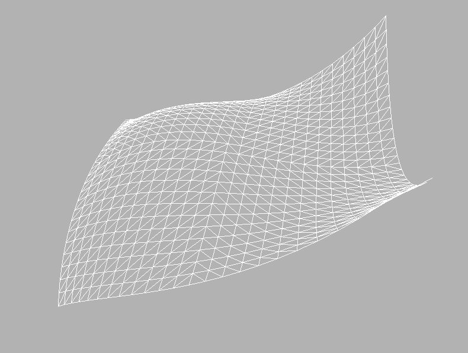
  
* Chapter 15 First Person Camera and Dynamic Indexing
  
  * *CameraAndDynamicIndexing* : Replace former manual camera settings with a new camera class.
  
    
  
* Chapter 16 Instancing and Frustum Culling
  
  * *InstancingAndCulling* : Use instancing to render multiple skulls and use frustum culling to reduce draw calls.
  
    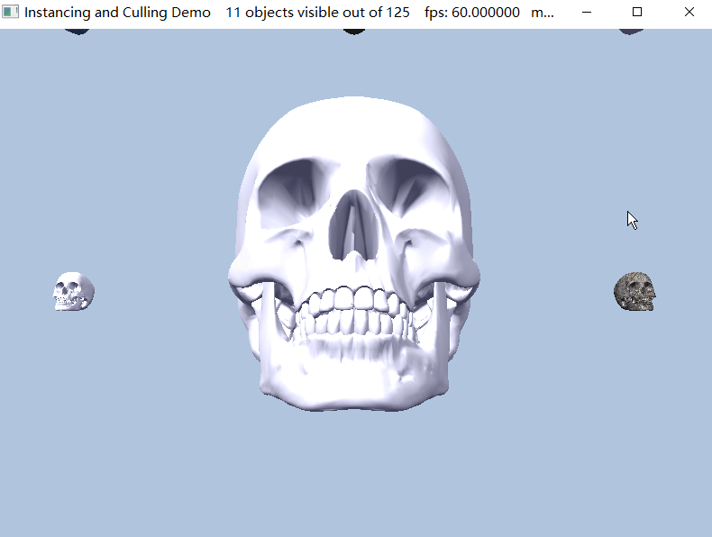
  
* Chapter 17 Picking
  
  * *Picking* : renders a car mesh and allows the user to pick a triangle by pressing the right mouse button, and the selected triangle is rendered using a *highlight* material.
  
    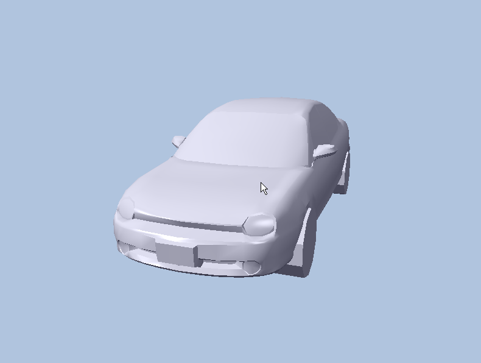
  
* Chapter 18 Cube Mapping
  * *CubeMap* : This demo is based on the *TexColumns* demo, adding a background texture by cube mapping. All the objects in the scene share the same environment map.
  
    
  
  * *DynamicCube* :  Instead of a static background texture, build the cube map at runtime. That is, every frame the camera is positioned in the scene that is to be the origin of the cube map, and then render the scene six times into each cube map face along each coordinate axis direction. Since the cube map is rebuilt every frame, it will capture animated objects in the environment, and the reflection will be animated as well.
  
    
  
* Chapter 19 Normal Mapping
  
  * *NormalMap* : This demo is based on the *CubeMap* demo. It also implements normal mapping such that the fine details that show up in the texture map also show up in the lighting.
  
    
  
* Chapter 20 Shadow Mapping

  * *Shadows* :  This demo is based on the *NormalMap* demo. The shadow map is rendered onto a quad that occupies the lower right corner of the screen.

    

* Chapter 21 Ambient Occlusion

  * *Ssao* : This demo is based on the *Shadows* demo, with the SSAO map applied. 

    

* ...

## Exercises

* Chapter 06 Drawing in Direct3D
  * [x] *Exercise_06_02*

    > Now vertex position and color data are separated into two structures, towards different input slot. Therefore, some *Common* data structure and functions need to be modified (affected files are separated in directory *Common modified*). And there should be two vertex data buffers for position and color.

  * [x] *Exercise_06_03*

    > Draw point list, line strip, line list, triangle strip, triangle list in the same scene. To draw different primitives, create pipeline state objects (PSOs) for point, line, triangle respectively during initialization. Then before each draw call, set proper PSO and primitive topology argument.

    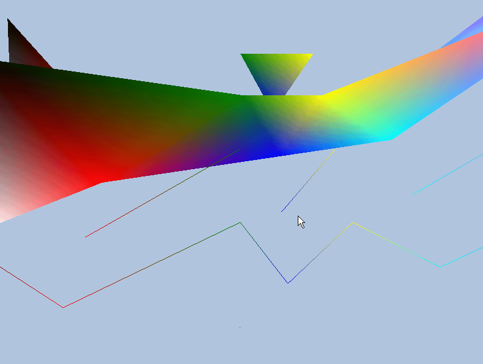
  
  * [x] *Exercise_06_07*
  
    > Draw a box and a pyramid one-by-one with merged vertex and index buffer in the same scene. Similar to exercise *Exercise_06_03*. Also implement color changing in pixel shader after adding a `gTime` constant buffer variable.
    
    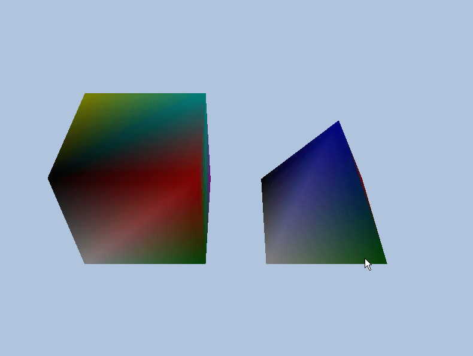
  
* Chapter 07 Drawing in Direct3D Part II

  * [x] *Exercise_07_02*

    > Modify the *Shapes* demo to use sixteen root constants to set the per-object world matrix instead of a descriptor table. Now we only need constant buffer views (CBVs) for each frame. The root signature and resource binding before drawcall should be modified, as well as the world matrix struct in shader file. 

  * [x] *Exercise_07_03*

    > Render a skull model above a platform. The vertex and index lists needed are in *Model/skull.txt*. The color of each vertex on the skull is based on the normal of the vertex. Note that the index count of skull is over 65536, which means we need to change `uint16_t` into `uint32_t`.
    
    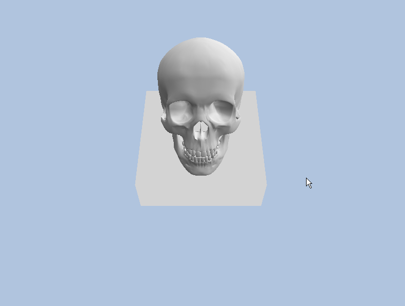

* Chapter 08 Lighting

  * [x] *Exercise_08_01*

    > Modify the *LitWaves* demo so that the directional light only emits mostly red light. In addition, make the strength of the light oscillate as a function of time using the sine function so that the light appears to pulse. Also change the roughness in the materials as the same way.
    
    
    
  * [x] *Exercise_08_04*

    > Modify the *LitColumns* demo by removing the three-point lighting, adding a point centered about each sphere above the columns, or adding a spotlight centered about each sphere above the columns and aiming down. Press "1" to switch between these two mode. 

    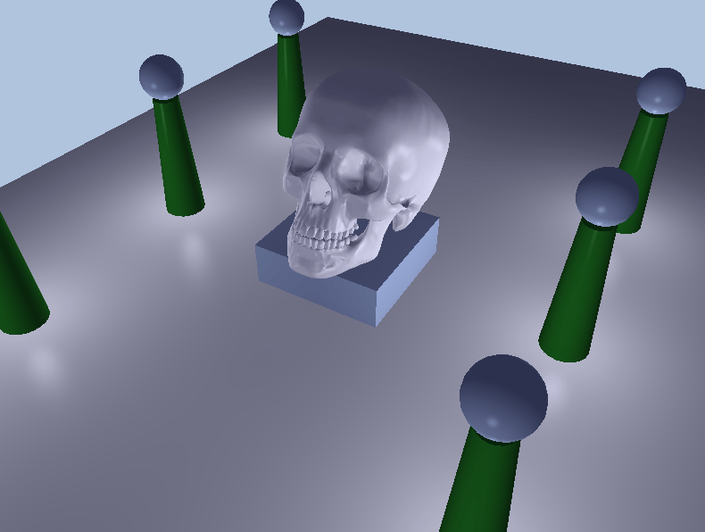

  * [x] *Exercise_08_06*

    > Modify the *LitWaves* demo to use the sort of cartoon shading as follows:
    >
    > 
    >
    > kd for each element in diffuse albedo.
    >
    > ks for each element in specular albedo.
    >
    > (Note: The functions f and g above are just sample functions to start with, and can be tweaked until we get the results we want.)
    
    

* Chapter 09 Texturing

  * [x] *Exercise_09_03*

    > Modify the *Crate* demo by combining two source textures(`flare.dds` and `flarealpha.dds`) in a pixel shader to produce a fireball texture over each cube face, and rotate the flare texture around its center as a function of time.
    
    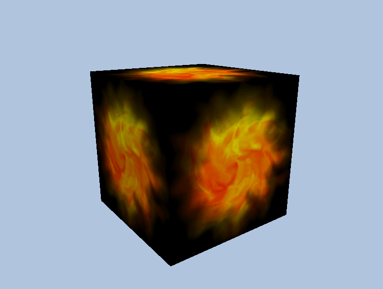

* Chapter 11 Stenciling

  * [x] *Exercise_11_07*

    > Modify the *Blend* demo from Chapter 10 to draw a cylinder (with no caps) at the center of the scene. Texture the cylinder with the 60 frame animated electric bolt animation using additive blending. We can set a member variable for current texture index. In each draw call, get the proper texture image indicated by this index and increase it for next draw call (using modulus operation to loop the index).
    
    
    
  * [x] *Exercise_11_08*

    > Render the depth complexity of the scene used in the *Blend* demo from Chapter 10. First draw the original scene while using stencil buffer as the depth complexity counter buffer(set `StencilFunc` to `D3D12_COMPARISON_FUNC_ALWAYS` to pass all stencil tests and set `StencilPassOp` to `D3D12_STENCIL_OP_INCR` to increase the value in stencil buffer every time a pixel fragment is processed). Then, after the frame has been drawn, visualize the depth complexity by associating a special color for each level of depth complexity.
    >
    > For each level of depth complexity k: set the stencil comparison function to `D3D12_COMPARISON_EQUAL` , set all the test operations to `D3D12_STENCIL_OP_KEEP` to prevent changing any counters, and set the stencil reference value to k (Also set `DepthFunc` to `D3D12_COMPARISON_FUNC_ALWAYS` and set `DepthWriteMask` to `D3D12_DEPTH_WRITE_MASK_ZERO` to pass all depth test will not changing any depth value), and then draw a quad of color ck that covers the entire projection window. Note that this will only color the pixels that have a depth complexity of k because of the preceding set stencil comparison function and reference value.

    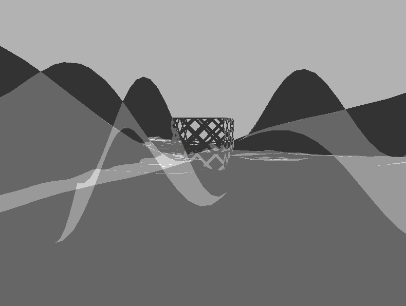

  * [x] *Exercise_11_09*

    > Another way to implement depth complexity visualization is to use additive blending. First clear the back buffer black and disable the depth test(pass all tests). Next, set the source and
    > destination blend factors both to `D3D12_BLEND_ONE`, and the blend operation to `D3D12_BLEND_OP_ADD` so that the blending equation looks like C = Csrc + Cdst. Now render all the objects in the scene with a pixel shader that outputs a low intensity color like (0.05, 0.05, 0.05). The more overdraw a pixel has, the more of these low intensity colors will be summed in, thus increasing the brightness of the pixel. Thus by looking at the intensity of each pixel after rendering the scene, we obtain an idea of the scene depth complexity.

    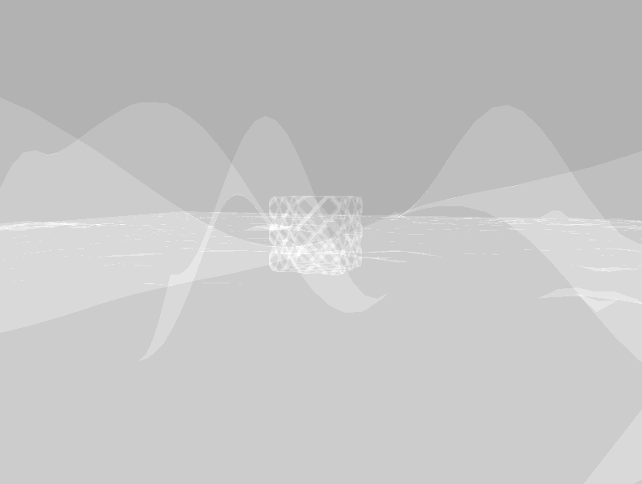

  * [x] *Exercise_11_11*

    > Modify the *Mirror* demo to reflect the floor into the mirror in addition to the skull. Also add the shadow of skull into reflection.
    
    

* Chapter 12 The Geometry Shader

  * [x] *Exercise_12_01*

    > Consider a circle, drawn with a line strip, in the xz-plane. Expand the line strip into a cylinder with no caps using the geometry shader. To do this, we can create a quad for each line segment in the geometry shader.

    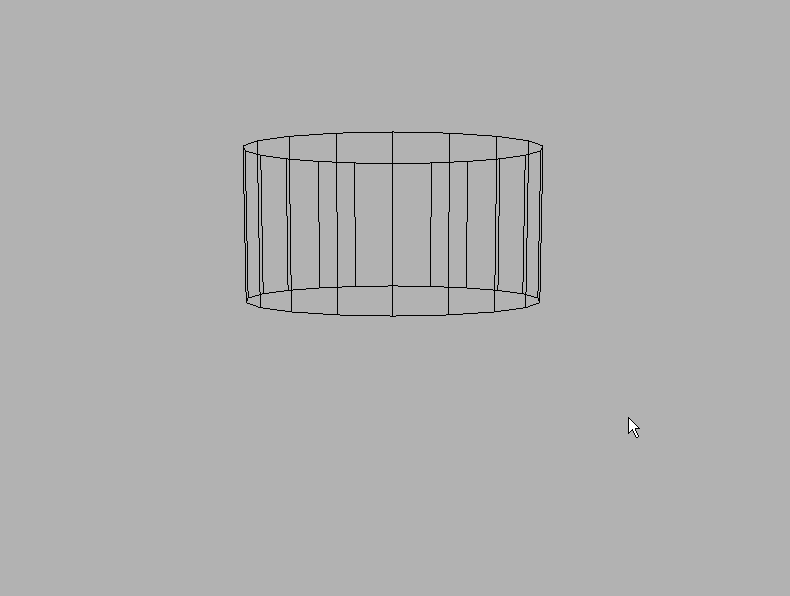

  * [x] *Exercise_12_02*

    > Build and render an icosahedron. Use a geometry shader to subdivide the icosahedron based on its distance d from the camera. If d < 15, then subdivide the original icosahedron twice; if 15 ≤ d < 30 , then subdivide the original icosahedron once; if d ≥ 30, then just render the original icosahedron.

    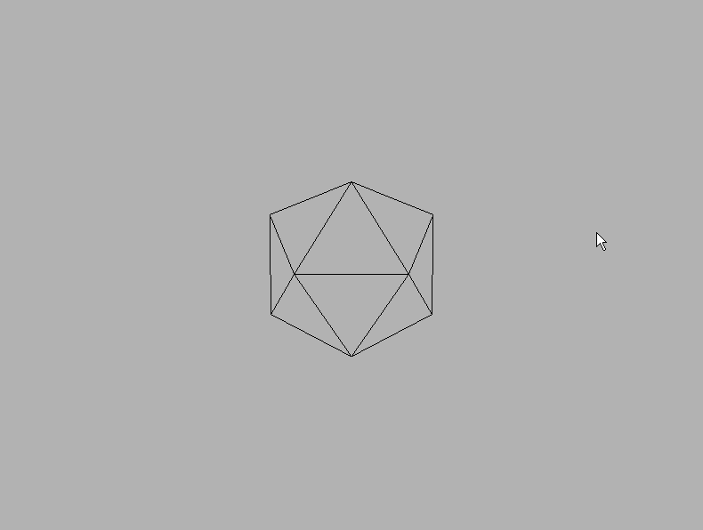

  * [x] *Exercise_12_03*

    > A simple explosion effect can be simulated by translating triangles in the direction of their face normal as a function of time. Use an icosahedron (not subdivided) as a sample mesh for implementing this effect. The normal vector of a triangle can be calculated by the cross product of two its edges (be careful of the direction of the normal vector);

    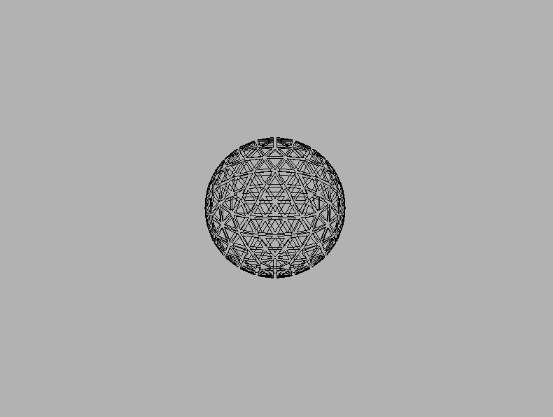

  * [x] *Exercise_12_04*

    > Write an effect that renders the vertex normals of a mesh as short line segments. After this is implemented, draw the mesh as normal, and then draw the scene again with the normal vector visualization technique so that the normals are rendered on top of the scene. Use the *Blend* demo as a test scene. Similarly add an effect that renders the face normals of a mesh as short line segments.
    >
    > First we create a set of PSOs for wire frame mode to help us to observe the normal vectors, then another two sets of PSOs for vertex normal visualization and face normal visualization. In the geometry shader, calculate the root point(the vertex itself for vertex normal and the triangle center for face normal), move it in the direction of the normal to get the head point, then output this line segment into the output line stream.
    >
    > In this demo, press '1' to visualize vertex normals, press '2' to visualize face normals,  press '3' to switch to wire frame mode.   
    
    

* Chapter 13 The Compute Shader

  * [x] *Exercise_13_01*

    > Write a compute shader that inputs a structured buffer of sixty-four 3D vectors with random magnitudes contained in [1, 10]. The compute shader computes the length of the vectors and outputs the result into a floating-point buffer. Copy the results to CPU memory and save the results to file.

  * [x] *Exercise_13_04*

    > Research the bilateral blur technique and implement it on the compute shader. Redo the *Blur* demo using the bilateral blur. 
    >
    > The bilateral filter is defined as: 
    >
    > %20=%20\frac{1}{W_p}\sum_{x_i\in\Omega}I(x_i)f_r({\parallel}I(x_i)%20-%20I(x){\parallel})g_s({\parallel}x_i%20-%20x{\parallel})) 
    >
    > where:
    >
    >  is the filtered image.
    >
    >  is the original input image to be filtered.
    >
    >   are the coordinates of the current pixel to be filtered.
    >
    >  is the window centered in , so  is another pixel.
    >
    >  is the range kernel for smoothing differences in intensities (can be a Gaussian function).
    >
    >  is the spatial (or domain) kernel for smoothing differences in coordinates (can be a Gaussian function).
    >
    > 
    >
    > So we can just add the range kernel part to the existing Gaussian blur shader.
    >
    > Consider a pixel located at `(i,j)` that needs to be denoised in image using its neighbouring pixels and one of its neighbouring pixels is located at `(k, l)`. Then, assuming the range and spatial kernels to be Gaussian kernels, the weight assigned for pixel (k, l) to denoise the pixel `(i,j)` is given by:
    >
    > %20=%20exp(-\frac{(i%20-%20k)^2%20+%20(j%20-%20l)^2}{2{\sigma_d}^2}%20-%20\frac{{\parallel}I(i,j)%20-%20I(k,l){\parallel}^2}{2{\sigma_r}^2})%20=%20weight[i,j]%20*%20exp(-\frac{{\parallel}I(i,j)%20-%20I(k,l){\parallel}^2}{2{\sigma_r}^2}))
    >
    > where the spacial kernel weight factor `weight[i,j]` has been calculated on the CPU side.
    
    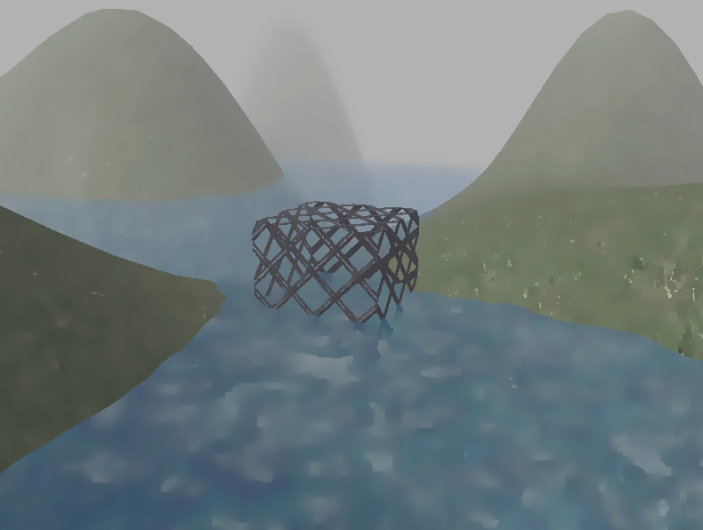

* Chapter 14 The Tessellation Stages

  * [x] *Exercise_14_01*

    > Redo the *BasicTessellation* demo, but tessellate a triangle patch instead of a quad patch. For a triangle patch, use barycentric coordinates instead of bilinear interpolation.

    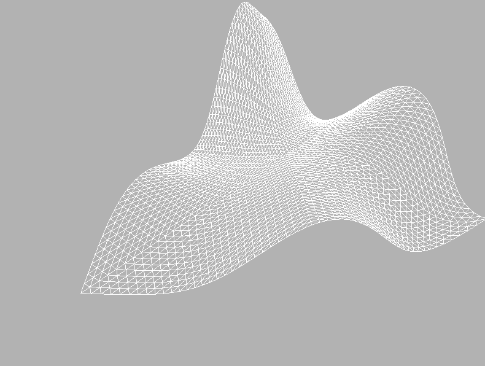

  * [x] *Exercise_14_02*

    > Tessellate an icosahedron into a sphere based on distance. Displace the generated vertices based on the radius of the sphere.

    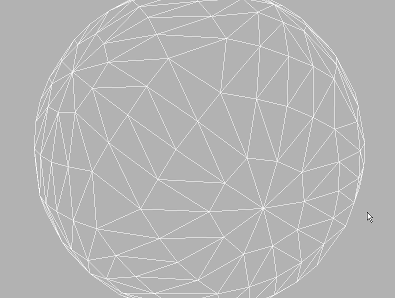

  * [x] *Exercise_14_07*

    > Redo the “Bézier Patch” demo to use a quadratic Bézier surface with nine control points. Then  light and shade the Bézier surface. Vertex normals are computed in the domain shader. A normal at a vertex position can be found by taking the cross product of the partial derivatives at the position.

    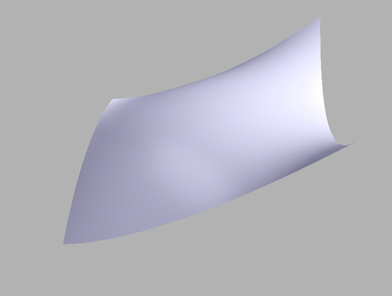

  * [x] *Exercise_14_09*

    > Research and implement Bézier triangle patches. Here I use Cubic Bézier triangle with 10 control points. [Bézier triangle](https://en.wikipedia.org/wiki/B%C3%A9zier_triangle)
    
    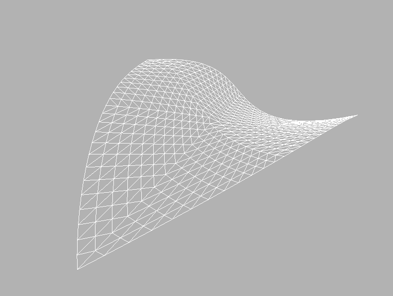

* Chapter 15 First Person Camera and Dynamic Indexing

  * [x] *Exercise_15_02*

    > Modify the camera demo to support rolling, by which the camera rotates around its `lookAt` vector (Press Q/E to roll counterclockwise/clockwise). Besides, create a single mesh that stores the geometry for the five boxes at the different positions, and create a single render-item for the five boxes. Add an additional field to the vertex structure that is an index to the texture to use. Bind all five textures to the pipeline once per frame, and use the vertex structure index to select the texture to use in the pixel shader. So that we can draw five boxes with five different textures with one draw call.
    
    
  
* Chapter 16 Instancing and Frustum Culling

  * [x] *Exercise_16_01*

    > Modify the *Instancing and Culling* demo to use bounding spheres instead of bounding boxes. For convenience, change field `BoundingBox` of `SubmeshGeometry`  into `BoundingSphere`. (`d3dUtil.h` under directory `Common modified`)

* Chapter 17 Picking

  * [x] *Exercise_17_01*

    > Modify the “Picking” demo to use a bounding sphere for the mesh instead of an AABB. Modification is similar to the exercise in last chapter.

* Chapter 18 Cube Mapping

  * [x] *DynamicCubeMapGS*

    > Use the geometry shader to render a cube map by drawing the scene only once. That is, we have bound a view to an array of render targets and a view to an array of depth stencil buffers to the OM stage, and we are going to render to each array slice simultaneously. Also add dielectric material to implement refraction on some objects.
    
    

* Chapter 19 Normal Mapping

  * [x] *Exercise_19_04*

    > Instead of doing lighting in world space, we can transform the eye and light vector from world space into tangent space and do all the lighting calculations in that space. Modify the normal mapping shader to do the lighting calculations in tangent space. Sampling the cubemap for background still needs to be done in world space.

  * [ ] *Exercise_19_05*

    > Implement the ocean wave effect using the two ocean wave heightmaps (and corresponding normal maps).

* ...